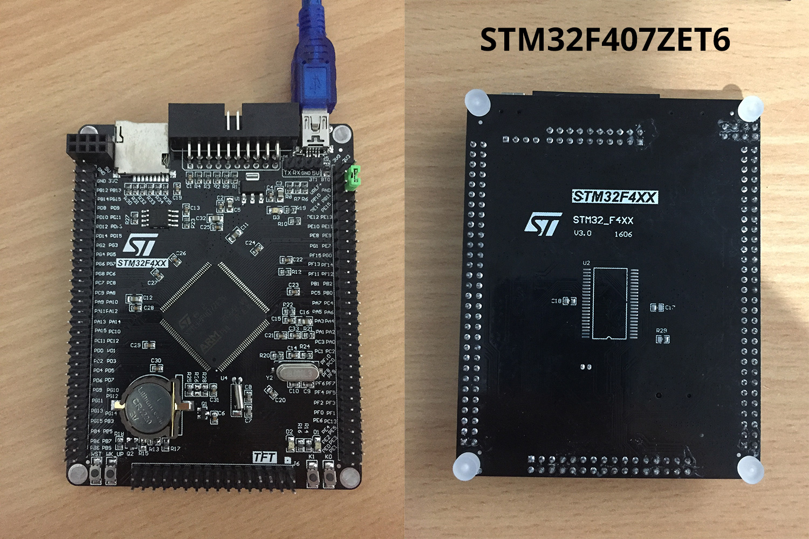

# MCUDev Black STM32F407ZET6

MicroPython board definition files for the MCUDev black STM32F407ZET6 dev board.

**Brand:** MCUDev

**Markings:** STM32F4XX STM32_F4XX V3.0 1606



You can buy one for around $21 AUD (Oct 2019) on [AliExpress].

### Build the firmware

Clone the board definitions to your [MicroPython](https://github.com/micropython/micropython) `ports/stm32/boards` folder.

```bash
cd micropython/ports/stm32/boards
git clone https://github.com/mcauser/BLACK_F407ZE.git

cd ..
make BOARD=BLACK_F407ZE
```

### Flashing via DFU

This board can be flashed using DFU. To put the board in DFU mode, disconnect
USB, set BOOT0 to ON by connecting pin BT0 to 3V3 and reconnect USB.

Now you can flash the board using USB with the command:

```bash
make BOARD=BLACK_F407ZE deploy
```

Once the upload is complete, disconnect USB, set BOOT0 to OFF by connecting
pin BT0 to GND and reconnect USB.

Alternatively, you can use the MicroPython command `pyb.bootloader()`
to get into DFU mode without needing to use the switch.

Currently, you need to unplug and replug the board in order to switch from DFU
mode back to regular mode.

### Accessing the board

Once built and deployed, you can access the MicroPython REPL (the Python prompt) via USB serial.

```bash
screen /dev/tty.usbmodem1422 115200
# or
screen /dev/ttyACM0 115200
```

### Specifications

* STM32F407ZET6 ARM Cortex M4
* 168MHz, 210 DMIPS / 1.25 DMIPS / MHz
* 1.8V - 3.6V operating voltage
* 8MHz system crystal
* 32.768KHz RTC crystal
* 2.54mm pitch pins
* JTAG/SWD header
* 512KByte Flash, 192 + 4 KByte SRAM
* 3x SPI, 3x USART, 2x UART, 2x I2S, 3x I2C
* 1x FSMC, 1x SDIO, 2x CAN
* 1x USB 2.0 FS / HS controller (with dedicated DMA)
* 1x USB HS ULPI (for external USB HS PHY)
* Micro SD
* Winbond W25Q16 16Mbit SPI Flash
* RTC battery CR1220
* 1MB SRAM footprint, unpopulated (IS62WV51216-1M)
* 1x 10/100 Ethernet MAC
* 1x 8 to 12-bit Parallel Camera interface
* 3x ADC (12-bit / 16-channel)
* 2x DAC (12-bit)
* 12x general timers, 2x advanced timers
* AMS1117-3.3V: 3.3V LDO voltage regulator, max current 800mA
* Micro USB for power and comms
* Yellow user LED D1 (PF9) active low
* Yellow user LED D2 (PF10) active low
* Yellow power LED D3
* 2x jumpers for bootloader selection
* Reset button, Wakeup button, 2x user buttons K0 (PE4) and K1 (PE3)
* 2x30 side pins + 2x16 bottom pins + 1x4 ISP pins
* 2x16 FSMC LCD Interface
* NRF24L01 socket
* M3 mounting holes
* Dimensions: 95.1mm x 74.6mm

### Exposed Port Pins

* PA0-PA15
* PB0-PB15
* PC0-PC13 (PC14 OSC32_IN and PC15 OSC32_OUT not broken out)
* PD0-PD15
* PE0-PE15
* PF0-PF15
* PG0-PG15

### Peripherals

#### TFT (J6)

* 1 GND
* 2 RST
* 3 PD10 FSMC_D15
* 4 PD9 FSMC_D14
* 5 PD8 FSMC_D13
* 6 PE15 FSMC_D12
* 7 PE14 FSMC_D11
* 8 PE13 FSMC_D10
* 9 PE12 FSMC_D9
* 10 PE11 FSMC_D8
* 11 PE10 FSMC_D7
* 12 PE9 FSMC_D6
* 13 PE8 FSMC_D5
* 14 PE7 FSMC_D4
* 15 PD1 FSMC_D3
* 16 PD0 FSMC_D2
* 17 PD15 FSMC_D1
* 18 PD14 FSMC_D0
* 19 PD4 FSMC_NOE
* 20 PD5 FSMC_NWE
* 21 PF12 FSMC_A6
* 22 PG12 FSMC_NE4
* 23 PB0 T_SCK
* 24 PC13 T_CS
* 25 PF11 T_MOSI
* 26 PB2 T_MISO
* 27 PB1 T_PEN
* 28 PB15 LCD_BL
* 29 NC
* 30 GND
* 31 3V3
* 32 GND

#### SPI Flash W25Q16 (U3)

* 1 PB14 F_CS
* 2 PB4 SPI1_MISO
* 3 WP 3V3
* 4 GND
* 5 PB5 SPI1_MOSI
* 6 PB3 SPI1_SCK
* 7 HOLD 3V3
* 8 VCC 3V3

#### JTAG/SWD debug (J1)

* 1 3V3 Vref
* 2 3V3 Vsupply
* 3 PB4 TRST
* 4 GND
* 5 PA15 TDI
* 6 GND
* 7 PA13 TMS
* 8 GND
* 9 PA14 TCK
* 10 GND
* 11 NC RTCK
* 12 GND
* 13 PB3 TDO
* 14 GND
* 15 RST
* 16 GND
* 17 NC
* 18 GND
* 19 NC
* 20 GND

#### ISP (J5)

* 1 5V
* 2 GND
* 3 PA10 RXD1
* 4 PA9 TXD1

#### USB (J4)

* 1 VCC 5V
* 2 PA11 USB_DM
* 3 PA12 USB_DP
* 4 NCC
* 5 GND

#### Micro SD (U5)

* 1 PC10 SDIO_D2
* 2 PC11 SDIO_D3
* 3 PD2 SDIO_CMD
* 4 3V3
* 5 PC12 SDIO_SCK
* 6 GND
* 7 PC8 SDIO_D0
* 8 PC9 SDIO_D1
* 9 GND

#### NRF24L01 (J8)

* 1 GND
* 2 3V3
* 3 PG6 NRF_CE
* 4 PG7 NRF_CS
* 5 PB3 SPI1_SCK
* 6 PB5 SPI1_MOSI
* 7 PB4 SPI1_MISO
* 8 PG8 NRF_IRQ

#### User Button (K0)

* PE4 KEY0, active low

#### User Button (K1)

* PE3 KEY1, active low

#### User Button (WK_UP)

* PA0 WK_UP, active high

#### User LED (D1)

* PF9 LED0

#### User LED (D2)

* PF10 LED1

#### Battery (Q1)

* 1 BAT54C
* 2 3V3
* 3 GND VBAT

#### SDRAM (U2)

* 1 PF4 FSMC_A4
* 2 PF3 FSMC_A3
* 3 PF2 FSMC_A2
* 4 PF1 FSMC_A1
* 5 PF0 FSMC_A0
* 6 PG10 FSMC_NE3
* 7 PD14 FSMC_D0
* 8 PD15 FSMC_D1
* 9 PD0 FSMC_D2
* 10 PD1 FSMC_D3
* 11 3V3
* 12 GND
* 13 PE7 FSMC_D4
* 14 PE8 FSMC_D5
* 15 PE9 FSMC_D6
* 16 PE10 FSMC_D7
* 17 PD5 FSMC_NWE
* 18 PD11 FSMC_A16
* 19 PG5 FSMC_A15
* 20 PG4 FSMC_A14
* 21 PG3 FSMC_A13
* 22 PG2 FSMC_A12
* 23 PD12 FSMC_A17
* 24 PG1 FSMC_A11
* 25 PG0 FSMC_A10
* 26 PF15 FSMC_A9
* 27 PF14 FSMC_A8
* 28 PD13 FSMC_A18
* 29 PE11 FSMC_D8
* 30 PE12 FSMC_D9
* 31 PE13 FSMC_D10
* 32 PE14 FSMC_D11
* 33 3V3
* 34 GND
* 35 PE15 FSMC_D12
* 36 PD8 FSMC_D13
* 37 PD9 FSMC_D14
* 38 PD10 FSMC_D15
* 39 PE0 FSMC_NBL0
* 40 PE1 FSMC_NBL1
* 41 PD4 FSMC_NOE
* 42 PF13 FSMC_A7
* 43 PF12 FSMC_A6
* 44 PF5 FSMC_A5

### Links

* [STM32F407ZE on st.com](http://www.st.com/content/st_com/en/products/microcontrollers/stm32-32-bit-arm-cortex-mcus/stm32-high-performance-mcus/stm32f4-series/stm32f407-417/stm32f407ze.html)
* Buy on [AliExpress] or search for "STM32F407ZET6"
* Buy on [Taobao](https://item.taobao.com/item.htm?id=523276050344)
* [STM32F407ZET6 datasheet](https://github.com/mcauser/BLACK_F407ZE/blob/master/docs/STM32F407ZET6_datasheet.pdf)
* [STM32F407ZET6 schematics](https://github.com/mcauser/BLACK_F407ZE/blob/master/docs/STM32F407ZET6_schematics.pdf)

### Related boards

* [MCUDev Black STM32F407VET6](https://github.com/mcauser/BLACK_F407VE)
* [MCUDev Black STM32F407ZET6](https://github.com/mcauser/BLACK_F407ZE) - this board
* [MCUDev Black STM32F407ZGT6](https://github.com/mcauser/BLACK_F407ZG)
* [MCUDev DevEBox STM32F407VET6](https://github.com/mcauser/MCUDEV_DEVEBOX_F407VET6)
* [MCUDev DevEBox STM32F407VGT6](https://github.com/mcauser/MCUDEV_DEVEBOX_F407VGT6)
* [VCC GND STM32F407VET6 Mini](https://github.com/mcauser/VCC_GND_F407VE)
* [VCC GND STM32F407ZGT6 Mini](https://github.com/mcauser/VCC_GND_F407ZG)

[AliExpress]: https://www.aliexpress.com/item/32689262341.html

## License

Licensed under the [MIT License](http://opensource.org/licenses/MIT).
